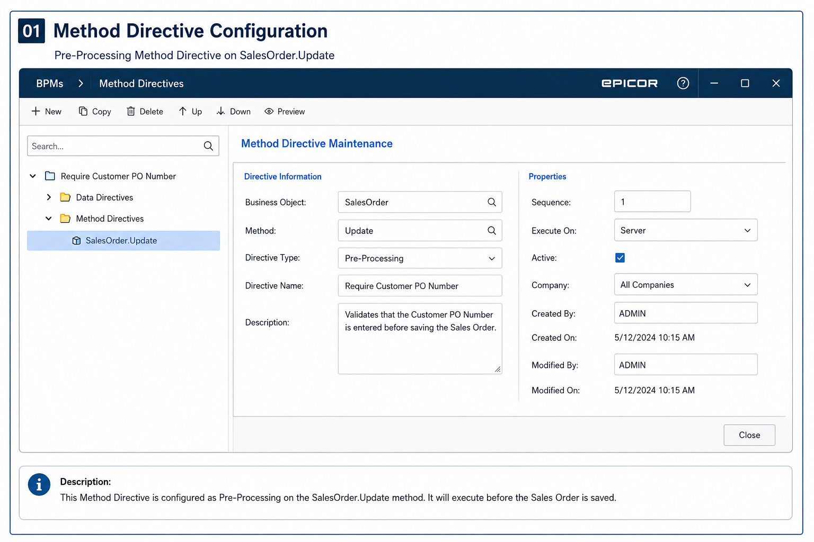
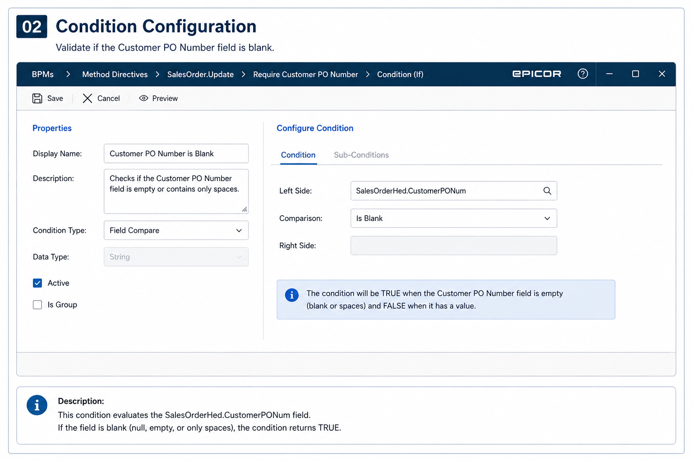
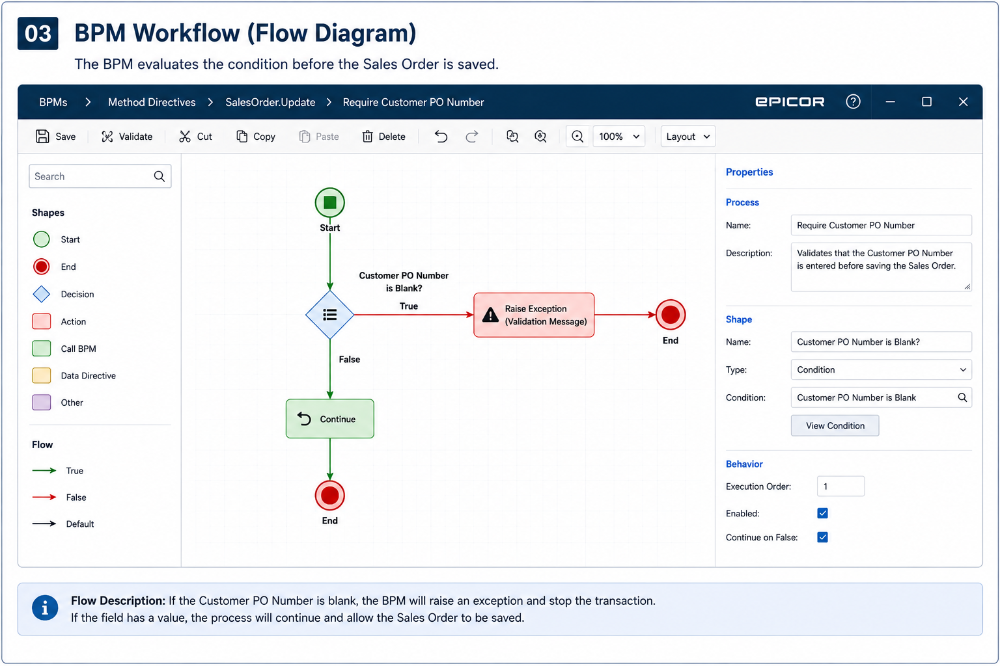
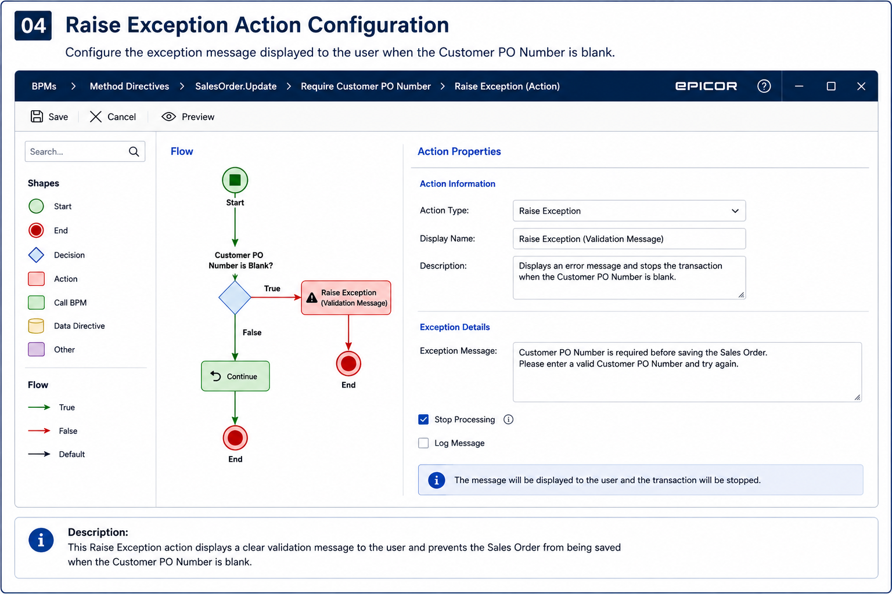

# Require Customer PO Number Before Saving a Sales Order

## Overview

This BPM example demonstrates how to validate that the **Customer PO Number** field is completed before allowing a Sales Order to be saved in Epicor ERP.

The purpose of this validation is to improve data quality, reduce missing customer references, and prevent incomplete orders from continuing through the sales process.

---

## Business Scenario

In many companies, a customer purchase order number is required before processing a sales order.

This information may be used by different departments such as customer service, shipping, accounting, production planning, and invoicing.

If the Customer PO Number is missing, the company may experience delays, invoice disputes, manual corrections, or tracking issues.

---

## Business Requirement

The system must prevent users from saving a Sales Order when the Customer PO Number is empty.

If the field is blank, Epicor should display an error message and stop the transaction.

---

## Method Directive

The validation is implemented using a **Pre-Processing Method Directive** on the `SalesOrder.Update` method.

---

### Business Object

Business Object: SalesOrder

Method: Update

Execution: Pre-Processing

---

### Condition

The BPM verifies whether the Customer PO Number is blank.

### BPM Workflow

The BPM evaluates the condition before the transaction is processed.

---

### Raise Exception

If the condition is true, the BPM stops the transaction and displays a validation message.

---

## Test Case 1

Customer PO Number = PO45897

Expected Result:

Sales Order is saved successfully.

## Test Case 2

Customer PO Number = Blank

Expected Result:

The Sales Order cannot be saved.

| Before BPM          | After BPM            |
| ------------------- | -------------------- |
| Missing Customer PO | Required Customer PO |
| Manual validation   | Automatic validation |
| Incomplete orders   | Valid orders         |
| User errors         | Standardized process |

## Possible Enhancements

This BPM can be expanded in the future to include additional rules, such as:

* Apply the validation only to specific customers.
* Apply the validation only to specific order types.
* Validate the Customer PO Number format.
* Allow exceptions for internal orders.
* Notify a supervisor when the validation fails.
* Log failed validation attempts for audit purposes.

---

## Skills Demonstrated

### Technical Skills

* Epicor BPM
* Method Directives
* Pre-Processing Logic
* Data Validation
* Exception Handling

### Documentation Skills

* Business scenario documentation
* Test case documentation
* ERP solution documentation
* Process flow explanation

---

## Notes

This example is intended for portfolio and learning purposes. The configuration can be adapted depending on the company process, Epicor version, and specific business requirements.

